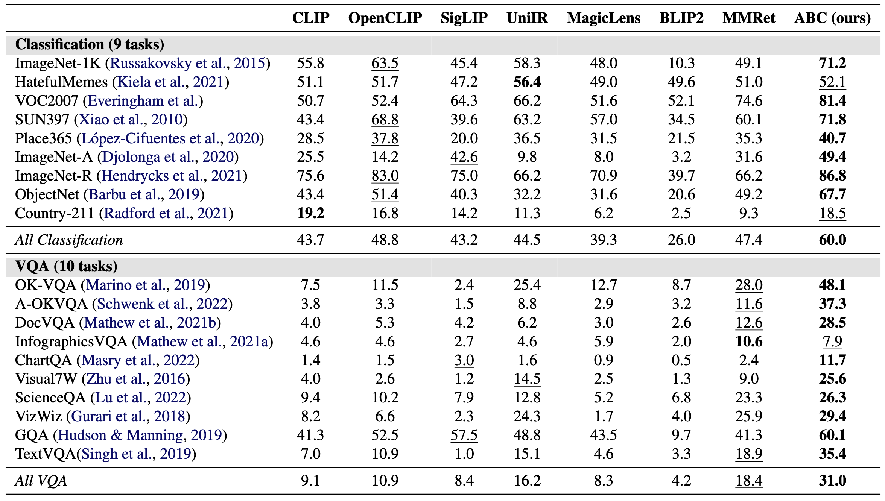

# ABC: Achieving Better Control of Multimodal Embeddings using VLMs
<a target="_blank" href="https://arxiv.org/abs/2503.00329">
</a>
<a target="_blank" href="https://github.com/TIGER-AI-Lab/ABC">
</a>
<a target="_blank" href="https://tiger-ai-lab.github.io/ABC/">
</a>
<a target="_blank" href="https://huggingface.co/TIGER-Lab/ABC-Qwen2VL-Instruct">
</a>
<a target="_blank" href="https://huggingface.co/datasets/TIGER-Lab/ABC-VG-Instruct">
</a>
<br>

<br>

<span style="font-size: 14pt; font-family: Roboto, Helvetica, Arial, Heveltica Neue, sans-serif">
     <b>Authors:</b>
     <a class="name" target="_blank" href="https://benjaminschneider.ca/">Benjamin Schneider</a>, 
     <a class="name" target="_blank" href="https://cs.uwaterloo.ca/~fkerschb/">Florian Kerschbaum</a>,
     <a class="name" target="_blank" href="https://wenhuchen.github.io/">Wenhu Chen</a>&nbsp; @ 
     <a class="btna" target="_blank" href="https://huggingface.co/TIGER-Lab">TIGER-Lab</a> &nbsp; 
     </span>

## 🔥News

- [2025/3/4] Release of the [ABC Paper](https://arxiv.org/abs/2503.00329), along with the first release of our [🤗 Model and Datasets](https://huggingface.co/collections/TIGER-Lab/abc-67bf2036a7c51b2a99aa9f54) on Hugging Face (more to come, stay tuned!).


## Overview


<details><summary>ABC's Design</summary>  


- We introduce ABC, an open-source multimodal embedding model that uses a
vision-language model backbone to deeply integrate image features with natural language
instructions.

- ABC is designed to give the user **maximum control** over how images are represented in embeddings. If you need to use naturral langauge to specify which aspects of an image you want emphasized and represented, ABC is the perfect model for you!

- The key behind ABC's training is that we pretrain the model using a large dataset of difficult embedding samples, where each batch contains many candidates that are relevant but not quite correct. The pretrained model is therefore able to generate embeddings that capture subtle differences. After a short finetuning stage, the model ideal for tasks like VQA, where differences in user instructions result in different correct answers (right).

- ABC outputs great quality embeddings, ABC achieves best-for-size performance on MSCOCO image-to-text retrieval and is the
top performing model on zero-shot classification and VQA tasks in the Massive Multimodal Embedding
Benchmark.

</details>

## 🤗 Models

| Model | Supports Instructions | Base Model | Training Dataset |
|:---------------------:|:-----------:|:----------------:|:--------------:|
| [ABC-Qwen2VL-Instruct](https://huggingface.co/TIGER-Lab/ABC-Qwen2VL-Instruct)  | ✅        | [ABC-Qwen2VL-Pretrain](https://huggingface.co/TIGER-Lab/ABC-Qwen2VL-Pretrain) | [TIGER-Lab/ABC-VG-Instruct]() |
| [ABC-Qwen2VL-Pretrain](https://huggingface.co/TIGER-Lab/ABC-Qwen2VL-Pretrain)  | ❌        | [Qwen2VL-Instruct](https://huggingface.co/Qwen/Qwen2-VL-7B-Instruct)     | [TIGER-Lab/ABC-Pretrain](https://huggingface.co/datasets/TIGER-Lab/ABC-Pretraining-Data)    |

## 📚 Datasets
- [ABC-VG-Instruct](https://huggingface.co/datasets/TIGER-Lab/ABC-VG-Instruct): A custom dataset for multimodal finetuning. Contains multiple instructions per image, each corresponding to different aspects of each image.
- [ABC-Pretrain](https://huggingface.co/datasets/TIGER-Lab/ABC-Pretraining-Data): Multimodal pretraining dataset with mined negatives.


## 🚀 Quick Start

Install Dependancies:
```bash
git clone $
cd ABC
pip install -r requirements.txt
```
Start making multimodal embeddings!
```bash
python -i ./quick_start.py
```

## 📈 Zero-shot Performance

Check out our [paper](https://arxiv.org/abs/2503.00329) for additional evaluations!

## 🤖 Training

🚧  
I'm currently figuring out the best way to make this as easy as possible (some of our data is quick large [~300 Gb of images]).  
Please chekc back in a few days! Hopefully I can serve the whole dataset off huggingface.  
🚧

## 🤖 `CtrlBench`

🚧  
`CtrlBench` is a benchmark we constructed for the purpose of measuring how well a model can interleave visual and ntural language features. We found that many existing "multimodal" tasks are solveable by just looking at *one of* the text or the image. `CtrlBench` is designed to be a retreival task that requires combining modalities to solve the benchmark, measuring the models ability to output truly "multimodal" embeddings. See our paper for a more detailed description of the design and motivations behind `CtrlBench`.
🚧

## Citation
If you find this work helpful, please consider citing:
```bibtex
@misc{schneider2025abcachievingbettercontrol,
      title={ABC: Achieving Better Control of Multimodal Embeddings using VLMs}, 
      author={Benjamin Schneider and Florian Kerschbaum and Wenhu Chen},
      year={2025},
      eprint={2503.00329},
      archivePrefix={arXiv},
      primaryClass={cs.CV},
      url={https://arxiv.org/abs/2503.00329}, 
}
```
